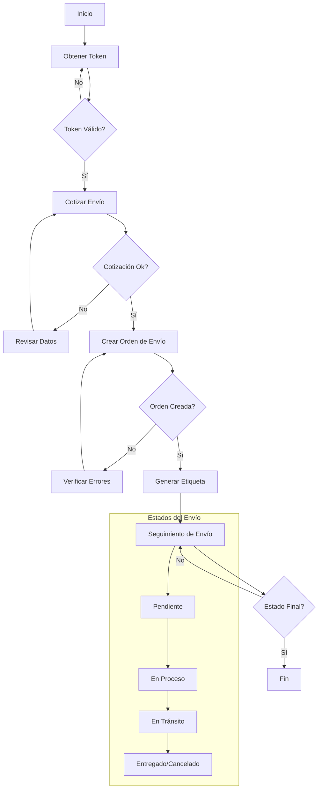

# Documentación API Andreani

## Índice de Contenidos

1. [Entornos](#entornos)
2. [Autenticación](#autenticación)
3. [Códigos de Barras y QR](#códigos-de-barras-y-qr)
4. [Cotizador](#cotizador)
5. [Localidades](#localidades)
6. [Multimedia](#multimedia)
7. [Etiquetas](#etiquetas)
8. [Órdenes de Envío](#órdenes-de-envío)
9. [Órdenes T&D](#órdenes-td)
10. [Sucursales](#sucursales)
11. [Tracking](#tracking)
12. [Eventos y Estados T&D](#eventos-y-estados-td)
13. [Ejemplos de Implementación en PHP](#ejemplos-de-implementación-en-php)
14. [Diagrama de Flujo del Proceso de Envío](#diagrama-de-flujo-del-proceso-de-envío)

## Descripción General

Esta documentación proporciona información detallada sobre los diferentes endpoints disponibles en la API de Andreani. Cada sección corresponde a un servicio específico y contiene la información necesaria para su implementación y uso.

## Entornos

La API de Andreani dispone de dos entornos:

### Producción
```
https://apis.andreani.com
```

### Debug (Sandbox)
```
https://apisqa.andreani.com
```

### Consideraciones de los Entornos

1. **Entorno de Debug (Sandbox)**
   - Ideal para desarrollo y pruebas
   - No genera órdenes reales
   - Las credenciales son diferentes a las de producción
   - Sin costo de envíos
   - Permite probar todos los estados y eventos

2. **Entorno de Producción**
   - Para uso en ambiente productivo
   - Genera órdenes reales
   - Requiere credenciales de producción
   - Los envíos generan costos reales
   - Conectado con el sistema operativo real de Andreani

### Recomendaciones
- Usar siempre el entorno de debug para desarrollo y pruebas
- Validar completamente la integración en debug antes de pasar a producción
- No mezclar credenciales entre entornos
- Mantener diferentes configuraciones para cada entorno

## Autenticación

Para utilizar las APIs de Andreani, necesitarás seguir estos pasos de autenticación:

### Obtener Credenciales

1. Para obtener las credenciales, deberás registrarte en el portal de desarrolladores de Andreani.
2. Una vez registrado, obtendrás:
   - Client ID
   - Client Secret

### Obtener Token de Acceso

1. **Endpoint**: `https://apis.andreani.com/login`
2. **Método**: POST
3. **Headers**:
   ```
   Content-Type: application/json
   x-authorization-token: {Base64(client_id:client_secret)}
   ```
4. **Respuesta**: Recibirás un token JWT que deberás utilizar en todas tus peticiones posteriores.

### Uso del Token

Para todas las llamadas a la API, deberás incluir el token JWT en el header de autorización:

```
Authorization: Bearer {tu-token-jwt}
```

### Consideraciones Importantes

- El token tiene un tiempo de expiración limitado
- Se recomienda implementar un sistema de renovación automática del token
- Mantén tus credenciales seguras y no las compartas
- Utiliza variables de entorno para almacenar las credenciales en tu aplicación

## Versiones Disponibles

A continuación se detallan las versiones disponibles de cada API:

- Códigos de Barras y QR: v2.0, v2.0.1
- Cotizador: v2.1.1
- Localidades: v2.0.1
- Multimedia: v2.0.1
- Obtener Etiqueta: v2.0
- Orden de Envío: v2.0
- Órdenes T&D: v2.0
- Sucursales: v2.0.2
- Tracking: v2.0, v2.0.1, v2.0.2

## Códigos de Barras y QR

La API de Códigos de Barras y QR (v2.0.1) permite generar y validar códigos de barras y códigos QR para envíos.

### Endpoint Base
```
https://apis.andreani.com/v2/codigos
```

### Generar Código de Barras

**Endpoint**: `/barras`
**Método**: POST

#### Headers Requeridos
```
Content-Type: application/json
Authorization: Bearer {tu-token-jwt}
```

#### Request Body
```json
{
  "tipo": "string",
  "contenido": "string",
  "formato": "PNG"
}
```

#### Respuesta Exitosa
- Content-Type: image/png o image/jpeg
- El contenido binario de la imagen del código de barras

### Generar Código QR

**Endpoint**: `/qr`
**Método**: POST

#### Headers Requeridos
```
Content-Type: application/json
Authorization: Bearer {tu-token-jwt}
```

#### Request Body
```json
{
  "contenido": "string",
  "nivelCorreccion": "L",
  "formato": "PNG",
  "tamanio": 200
}
```

#### Parámetros
- `nivelCorreccion`: Nivel de corrección de errores (L, M, Q, H)
- `tamanio`: Tamaño en píxeles del código QR (min: 100, max: 1000)
- `formato`: Formato de la imagen (PNG, JPG)

#### Respuesta Exitosa
- Content-Type: image/png o image/jpeg
- El contenido binario de la imagen del código QR

### Validar Código

**Endpoint**: `/validar`
**Método**: POST

#### Request Body
```json
{
  "tipo": "BARRAS|QR",
  "contenido": "string"
}
```

#### Respuesta Exitosa
```json
{
  "valido": true,
  "tipo": "string",
  "contenido": "string"
}
```

### Consideraciones
- Los códigos generados tienen un tiempo de validez
- Se recomienda almacenar temporalmente las imágenes generadas
- El nivel de corrección de errores afecta el tamaño del código QR
- Validar el contenido antes de generar los códigos

### Códigos de Estado
- 200: Operación exitosa
- 400: Parámetros inválidos
- 415: Formato no soportado
- 429: Demasiadas solicitudes

## Cotizador

La API de Cotizador (v2.1.1) te permite obtener cotizaciones para envíos según diferentes parámetros.

### Endpoint Base
```
https://apis.andreani.com/v2/cotizador
```

### Cotizar Envío

**Endpoint**: `/cotizar`
**Método**: POST

#### Headers Requeridos
```
Content-Type: application/json
Authorization: Bearer {tu-token-jwt}
```

#### Parámetros del Request

```json
{
  "cpDestino": "string",
  "sucursalOrigen": "string",
  "bultos": [
    {
      "valorDeclarado": 0,
      "volumen": 0,
      "kilos": 0,
      "altoCm": 0,
      "anchoCm": 0,
      "largoCm": 0
    }
  ],
  "cliente": "string",
  "contrato": "string"
}
```

#### Respuesta Exitosa

```json
{
  "tarifaConIva": 0,
  "tarifaSinIva": 0,
  "moneda": "ARS",
  "plazoEntrega": {
    "minimo": 0,
    "maximo": 0
  }
}
```

### Consideraciones
- Los valores de peso y dimensiones deben ser números positivos
- El código postal destino debe ser válido
- La sucursal de origen debe existir en el sistema
- El contrato debe estar activo

## Localidades

La API de Localidades (v2.0.1) permite consultar información sobre localidades y códigos postales.

### Endpoint Base
```
https://apis.andreani.com/v2/localidades
```

### Obtener Todas las Localidades

**Endpoint**: `/`
**Método**: GET

#### Parámetros de Query Opcionales
- `provincia`: Filtrar por nombre de provincia
- `codigoPostal`: Filtrar por código postal
- `localidad`: Buscar por nombre de localidad

#### Respuesta Exitosa
```json
[
  {
    "id": "string",
    "codigoPostal": "string",
    "nombre": "string",
    "provincia": {
      "id": "string",
      "nombre": "string"
    }
  }
]
```

### Obtener Localidad por ID

**Endpoint**: `/{idLocalidad}`
**Método**: GET

#### Respuesta Exitosa
```json
{
  "id": "string",
  "codigoPostal": "string",
  "nombre": "string",
  "provincia": {
    "id": "string",
    "nombre": "string"
  }
}
```

### Consideraciones
- Los nombres de localidades y provincias son case-sensitive
- Se recomienda implementar un sistema de caché para optimizar las consultas
- Algunos códigos postales pueden tener múltiples localidades asociadas

## Multimedia

La API de Multimedia (v2.0.1) permite gestionar y obtener archivos multimedia relacionados con los envíos.

### Endpoint Base
```
https://apis.andreani.com/v2/multimedia
```

### Subir Archivo Multimedia

**Endpoint**: `/`
**Método**: POST

#### Headers Requeridos
```
Content-Type: multipart/form-data
Authorization: Bearer {tu-token-jwt}
```

#### Parámetros del Form-Data
- `file`: Archivo a subir (imagen, PDF, etc.)
- `tipo`: Tipo de archivo multimedia
- `referencia`: Identificador de referencia (ej: número de envío)

#### Respuesta Exitosa
```json
{
  "id": "string",
  "nombre": "string",
  "tipo": "string",
  "referencia": "string",
  "url": "string",
  "fechaCreacion": "string"
}
```

### Obtener Archivo Multimedia

**Endpoint**: `/{id}`
**Método**: GET

#### Headers Requeridos
```
Authorization: Bearer {tu-token-jwt}
```

#### Respuesta Exitosa
- Content-Type: Según el tipo de archivo
- El contenido binario del archivo multimedia

### Listar Archivos por Referencia

**Endpoint**: `/referencia/{referencia}`
**Método**: GET

#### Respuesta Exitosa
```json
[
  {
    "id": "string",
    "nombre": "string",
    "tipo": "string",
    "referencia": "string",
    "url": "string",
    "fechaCreacion": "string"
  }
]
```

### Eliminar Archivo Multimedia

**Endpoint**: `/{id}`
**Método**: DELETE

#### Respuesta Exitosa
- Status: 204 No Content

### Consideraciones
- Tamaño máximo de archivo: 10MB
- Formatos soportados: JPG, PNG, PDF
- Los archivos tienen un tiempo de retención de 30 días
- Se recomienda implementar validación de tipos MIME
- Guardar las URLs devueltas para acceso posterior

### Códigos de Estado
- 200: Operación exitosa
- 201: Archivo creado correctamente
- 400: Formato de archivo no válido
- 413: Archivo demasiado grande
- 429: Demasiadas solicitudes

## Etiquetas

La API de Etiquetas (v2.0) permite generar y obtener etiquetas para los envíos.

### Endpoint Base
```
https://apis.andreani.com/v2/etiquetas
```

### Obtener Etiqueta

**Endpoint**: `/envios/{numeroEnvio}`
**Método**: GET

#### Headers Requeridos
```
Authorization: Bearer {tu-token-jwt}
```

#### Parámetros de URL
- `numeroEnvio`: Número de envío de Andreani

#### Parámetros de Query Opcionales
- `formato`: Formato de la etiqueta (PDF, ZPL)
- `tipoEtiqueta`: Tipo de etiqueta a generar

#### Respuesta Exitosa
- Content-Type: application/pdf o application/zpl
- El contenido binario de la etiqueta en el formato solicitado

### Consideraciones
- Las etiquetas tienen un tiempo de validez
- Se recomienda almacenar temporalmente las etiquetas generadas
- Algunos formatos pueden no estar disponibles para ciertos tipos de envíos

## Órdenes de Envío

La API de Órdenes de Envío (v2.0) permite crear y gestionar órdenes de envío.

### Endpoint Base
```
https://apis.andreani.com/v2/ordenes-de-envio
```

### Crear Orden de Envío

**Endpoint**: `/`
**Método**: POST

#### Headers Requeridos
```
Content-Type: application/json
Authorization: Bearer {tu-token-jwt}
```

#### Request Body
```json
{
  "contrato": "string",
  "origen": {
    "sucursal": "string"
  },
  "destino": {
    "direccion": {
      "calle": "string",
      "numero": "string",
      "piso": "string",
      "departamento": "string",
      "localidad": "string",
      "provincia": "string",
      "codigoPostal": "string"
    },
    "contacto": {
      "nombre": "string",
      "email": "string",
      "telefono": "string"
    }
  },
  "bultos": [
    {
      "kilos": 0,
      "altoCm": 0,
      "anchoCm": 0,
      "largoCm": 0,
      "volumen": 0,
      "valorDeclarado": 0,
      "referencias": [
        {
          "referencia": "string",
          "tipo": "string",
          "valor": "string"
        }
      ]
    }
  ]
}
```

#### Respuesta Exitosa
```json
{
  "numeroEnvio": "string",
  "numeroOrden": "string",
  "estado": {
    "id": 0,
    "nombre": "string"
  }
}
```

### Consultar Orden de Envío

**Endpoint**: `/{numeroEnvio}`
**Método**: GET

#### Respuesta Exitosa
```json
{
  "numeroEnvio": "string",
  "estado": {
    "id": 0,
    "nombre": "string"
  },
  "destino": {
    "direccion": {},
    "contacto": {}
  },
  "bultos": []
}
```

### Consideraciones
- Validar los datos del destinatario antes de crear la orden
- Los bultos deben cumplir con las dimensiones y pesos permitidos
- Guardar el número de envío para seguimiento posterior

## Órdenes T&D

La API de Órdenes T&D (v2.0) permite gestionar órdenes de Transporte y Distribución.

### Endpoint Base
```
https://apis.andreani.com/v2/ordenes-tyd
```

### Crear Orden T&D

**Endpoint**: `/`
**Método**: POST

#### Headers Requeridos
```
Content-Type: application/json
Authorization: Bearer {tu-token-jwt}
```

#### Request Body
```json
{
  "contrato": "string",
  "numeroPedido": "string",
  "remitente": {
    "nombre": "string",
    "direccion": {
      "calle": "string",
      "numero": "string",
      "localidad": "string",
      "provincia": "string",
      "codigoPostal": "string"
    }
  },
  "destinatario": {
    "nombre": "string",
    "direccion": {
      "calle": "string",
      "numero": "string",
      "localidad": "string",
      "provincia": "string",
      "codigoPostal": "string"
    },
    "contacto": {
      "email": "string",
      "telefono": "string"
    }
  },
  "bultos": [
    {
      "kilos": 0,
      "volumen": 0,
      "valorDeclarado": 0
    }
  ]
}
```

#### Respuesta Exitosa
```json
{
  "numeroOrden": "string",
  "estado": "string",
  "fechaCreacion": "string"
}
```

### Consultar Estado de Orden T&D

**Endpoint**: `/{numeroOrden}`
**Método**: GET

#### Respuesta Exitosa
```json
{
  "numeroOrden": "string",
  "estado": "string",
  "eventos": [
    {
      "fecha": "string",
      "estado": "string",
      "detalle": "string"
    }
  ]
}
```

### Consideraciones
- Las órdenes T&D tienen un flujo de estados específico
- Se debe validar la disponibilidad del servicio para la zona
- Los tiempos de entrega pueden variar según la región
- Es importante mantener actualizados los datos de contacto

### Códigos de Estado
- 200: Operación exitosa
- 400: Datos inválidos en la solicitud
- 404: Orden no encontrada
- 409: Conflicto en la operación
- 429: Demasiadas solicitudes

## Sucursales

La API de Sucursales (v2.0.2) permite obtener información sobre las sucursales de Andreani.

### Endpoint Base
```
https://apis.andreani.com/v2/sucursales
```

### Obtener Todas las Sucursales

**Endpoint**: `/`
**Método**: GET

#### Parámetros de Query Opcionales
- `codigoPostal`: Filtrar por código postal
- `provincia`: Filtrar por provincia
- `localidad`: Filtrar por localidad

#### Respuesta Exitosa
```json
[
  {
    "id": "string",
    "direccion": {
      "calle": "string",
      "numero": "string",
      "codigoPostal": "string",
      "localidad": "string",
      "provincia": "string",
      "pais": "string"
    },
    "telefonos": ["string"],
    "email": "string",
    "horarios": {
      "lunesAViernes": "string",
      "sabado": "string"
    },
    "latitud": 0,
    "longitud": 0
  }
]
```

### Obtener Sucursal por ID

**Endpoint**: `/{idSucursal}`
**Método**: GET

#### Respuesta Exitosa
Retorna el detalle de una sucursal específica en el mismo formato que la lista de sucursales.

### Consideraciones
- Las coordenadas geográficas están en formato decimal
- Los horarios pueden variar según la sucursal
- Algunas sucursales pueden no tener todos los campos completos
- Se recomienda implementar caché de sucursales para optimizar el rendimiento

### Códigos de Estado
- 200: Consulta exitosa
- 400: Parámetros inválidos
- 404: Sucursal no encontrada
- 429: Demasiadas solicitudes

## Tracking

La API de Tracking (v2.0.2) permite realizar el seguimiento de envíos.

### Endpoint Base
```
https://apis.andreani.com/v2/tracking
```

### Consultar Estado de Envío

**Endpoint**: `/envios/{numeroAndreani}`
**Método**: GET

#### Headers Requeridos
```
Authorization: Bearer {tu-token-jwt}
```

#### Parámetros de URL
- `numeroAndreani`: Número de envío de Andreani

#### Respuesta Exitosa
```json
{
  "numeroEnvio": "string",
  "estado": {
    "id": 0,
    "nombre": "string",
    "fecha": "string"
  },
  "eventos": [
    {
      "id": 0,
      "nombre": "string",
      "fecha": "string",
      "sucursal": {
        "id": "string",
        "nombre": "string"
      }
    }
  ]
}
```

### Consulta Masiva de Envíos

**Endpoint**: `/envios`
**Método**: POST

#### Request Body
```json
{
  "envios": ["string"]
}
```

### Códigos de Estado Comunes
- 200: Consulta exitosa
- 400: Parámetros inválidos
- 404: Envío no encontrado
- 429: Demasiadas solicitudes

## Eventos y Estados T&D

Esta sección describe los diferentes eventos y estados que puede tener una orden de Transporte y Distribución (T&D) en el sistema Andreani.

### Estados Principales

Los estados principales por los que puede pasar una orden T&D son:

1. **Pendiente**
   - Estado inicial de la orden
   - La orden fue creada pero aún no ha sido procesada

2. **En Proceso**
   - La orden está siendo procesada
   - Se está validando la información y preparando el envío

3. **En Tránsito**
   - El envío está en movimiento
   - Puede estar en ruta hacia el destino o entre sucursales

4. **Entregado**
   - El envío fue entregado exitosamente al destinatario
   - Se cuenta con la confirmación de entrega

5. **Cancelado**
   - La orden fue cancelada
   - Puede ser por solicitud del cliente o por problemas en la entrega

### Eventos del Sistema

Los eventos son registros detallados de las acciones y cambios de estado que ocurren durante el ciclo de vida de una orden T&D.

#### Tipos de Eventos

1. **Eventos de Creación**
   - Orden creada
   - Validación de datos
   - Asignación de número de seguimiento

2. **Eventos de Procesamiento**
   - Inicio de procesamiento
   - Verificación de dirección
   - Asignación de ruta

3. **Eventos de Tránsito**
   - Salida de centro de distribución
   - Llegada a sucursal
   - En ruta de entrega
   - Intento de entrega

4. **Eventos de Entrega**
   - Entrega exitosa
   - Entrega rechazada
   - Ausente en domicilio

5. **Eventos de Cancelación**
   - Cancelación por cliente
   - Cancelación por dirección incorrecta
   - Cancelación por mercadería dañada

### Estructura de Eventos

Cada evento en el sistema tiene la siguiente estructura:

```json
{
  "id": "string",
  "tipo": "string",
  "estado": "string",
  "fecha": "string",
  "descripcion": "string",
  "ubicacion": {
    "sucursal": "string",
    "direccion": "string"
  },
  "detalles": {
    "motivo": "string",
    "observaciones": "string"
  }
}
```

### Consideraciones

1. **Seguimiento de Estados**
   - Los estados siguen una secuencia lógica
   - No todos los estados son reversibles
   - Algunos estados pueden saltar a estados finales

2. **Notificaciones**
   - Los cambios de estado generan notificaciones
   - Se puede configurar qué eventos generan notificaciones
   - Las notificaciones pueden ser por email o webhook

3. **Tiempos de Transición**
   - Cada estado tiene tiempos esperados de transición
   - Los retrasos generan alertas automáticas
   - Se pueden configurar SLAs por tipo de servicio

### Códigos de Estado Específicos

#### Estados Exitosos
- 1000: Orden creada
- 2000: En procesamiento
- 3000: En tránsito
- 4000: Entregado

#### Estados de Error
- 5000: Error en procesamiento
- 5100: Error en validación
- 5200: Error en asignación
- 5300: Error en entrega

#### Estados de Cancelación
- 6000: Cancelado por cliente
- 6100: Cancelado por sistema
- 6200: Cancelado por operación

### Mejores Prácticas

1. **Monitoreo de Estados**
   - Implementar alertas para estados críticos
   - Revisar periódicamente órdenes estancadas
   - Mantener un registro histórico de cambios de estado

2. **Gestión de Excepciones**
   - Definir procesos para cada tipo de excepción
   - Establecer tiempos máximos por estado
   - Implementar escalamiento automático

3. **Reportes y Análisis**
   - Generar reportes de eficiencia por estado
   - Analizar patrones de eventos problemáticos
   - Identificar cuellos de botella en el proceso

## Ejemplos de Implementación en PHP

### Autenticación

```php
<?php
function obtenerToken($clientId, $clientSecret) {
    $credentials = base64_encode($clientId . ':' . $clientSecret);
    
    $ch = curl_init('https://apis.andreani.com/login');
    curl_setopt_array($ch, [
        CURLOPT_RETURNTRANSFER => true,
        CURLOPT_POST => true,
        CURLOPT_HTTPHEADER => [
            'Content-Type: application/json',
            'x-authorization-token: ' . $credentials
        ]
    ]);
    
    $response = curl_exec($ch);
    $httpCode = curl_getinfo($ch, CURLINFO_HTTP_CODE);
    curl_close($ch);
    
    if ($httpCode === 200) {
        return json_decode($response, true);
    }
    
    return false;
}
```

### Cotizar Envío

```php
<?php
function cotizarEnvio($token, $datos) {
    $ch = curl_init('https://apis.andreani.com/v2/cotizador/cotizar');
    curl_setopt_array($ch, [
        CURLOPT_RETURNTRANSFER => true,
        CURLOPT_POST => true,
        CURLOPT_HTTPHEADER => [
            'Content-Type: application/json',
            'Authorization: Bearer ' . $token
        ],
        CURLOPT_POSTFIELDS => json_encode($datos)
    ]);
    
    $response = curl_exec($ch);
    $httpCode = curl_getinfo($ch, CURLINFO_HTTP_CODE);
    curl_close($ch);
    
    if ($httpCode === 200) {
        return json_decode($response, true);
    }
    
    return false;
}

// Ejemplo de uso
$datos = [
    'cpDestino' => '1414',
    'sucursalOrigen' => 'COD_SUCURSAL',
    'bultos' => [
        [
            'valorDeclarado' => 1000,
            'volumen' => 1000,
            'kilos' => 1,
            'altoCm' => 10,
            'anchoCm' => 10,
            'largoCm' => 10
        ]
    ],
    'cliente' => 'TU_CLIENTE',
    'contrato' => 'TU_CONTRATO'
];
```

### Crear Orden de Envío

```php
<?php
function crearOrdenEnvio($token, $datos) {
    $ch = curl_init('https://apis.andreani.com/v2/ordenes-de-envio');
    curl_setopt_array($ch, [
        CURLOPT_RETURNTRANSFER => true,
        CURLOPT_POST => true,
        CURLOPT_HTTPHEADER => [
            'Content-Type: application/json',
            'Authorization: Bearer ' . $token
        ],
        CURLOPT_POSTFIELDS => json_encode($datos)
    ]);
    
    $response = curl_exec($ch);
    $httpCode = curl_getinfo($ch, CURLINFO_HTTP_CODE);
    curl_close($ch);
    
    if ($httpCode === 201) {
        return json_decode($response, true);
    }
    
    return false;
}
```

### Consultar Estado de Envío

```php
<?php
function consultarEstadoEnvio($token, $numeroEnvio) {
    $ch = curl_init("https://apis.andreani.com/v2/tracking/envios/{$numeroEnvio}");
    curl_setopt_array($ch, [
        CURLOPT_RETURNTRANSFER => true,
        CURLOPT_HTTPHEADER => [
            'Authorization: Bearer ' . $token
        ]
    ]);
    
    $response = curl_exec($ch);
    $httpCode = curl_getinfo($ch, CURLINFO_HTTP_CODE);
    curl_close($ch);
    
    if ($httpCode === 200) {
        return json_decode($response, true);
    }
    
    return false;
}
```

### Manejo de Errores

```php
<?php
function manejarError($httpCode, $response) {
    $errores = [
        400 => 'Datos inválidos en la solicitud',
        401 => 'No autorizado - Token inválido o expirado',
        404 => 'Recurso no encontrado',
        429 => 'Demasiadas solicitudes',
        500 => 'Error interno del servidor'
    ];
    
    $error = json_decode($response, true);
    $mensaje = $errores[$httpCode] ?? 'Error desconocido';
    
    return [
        'codigo' => $httpCode,
        'mensaje' => $mensaje,
        'detalles' => $error
    ];
}
```

## Diagrama de Flujo del Proceso de Envío



### Notas sobre el Diagrama
1. El proceso comienza con la autenticación para obtener el token
2. Se realiza una cotización antes de crear la orden
3. La creación de la orden incluye validaciones de datos
4. El seguimiento del envío es un proceso continuo hasta llegar a un estado final
5. Los estados pueden variar según el tipo de servicio

### Recomendaciones de Implementación
1. Implementar reintentos automáticos para la obtención del token
2. Cachear resultados de cotizaciones frecuentes
3. Implementar un sistema de notificaciones para cambios de estado
4. Mantener un log de todas las operaciones
5. Validar los datos antes de cada llamada a la API
